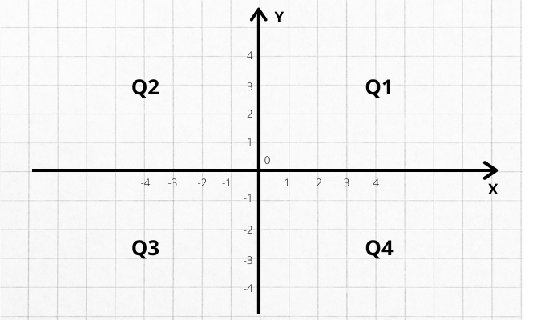

# Condicionais

## 1) Exercício Notas

Faça um programa para ler duas notas que um aluno obteve no primeiro e segundo semestre de uma disciplina anual.

Em seguida, mostre a nota final que o aluno obteve (com uma casa decimal) no ano juntamente com um texto explicativo.

Caso a nota final do aluno seja inferior a 60.0, mostrar a mensagem "REPROVADO", conforme exemplos.

### Exemplo 1

```
Informe a primeira nota: 45.5
Informe a segunda nota:  31.3

Nota final = 76.8
```

### Exemplo 2

```
Informe a primeira nota: 34.0
Informe a segunda nota:  23.5

Nota final = 57.5
REPROVADO
```
---

## 2) Exercício Operadora

Uma operadora de telefonia cobra R$ 50.00 por um plano básico de telefonia que dá direito a 100 minutos.

Cada minuto que extra à franquia de 100 minutos custa ao cliente R$ 2.00.

Faça um programa para ler a quantidade de minutos que o cliente consumiu, e mostre o valor a ser pago.

### Exemplo 1

```
Quantidade de minutos: 23

Valor a pagar = R$ 50.0
```

### Exemplo 2

```
Quantidade de minutos: 153

Valor a pagar = R$ 156.0
```

---

## 3) Exercício Múltiplos

Fazer um programa para ler dois números inteiros, e dizer se um número é múltiplo do outro.

Os números podem ser digitados em qualquer ordem.

### Exemplo 1

```
Informe dois números inteiros:
8
32

São múltiplos
```

### Exemplo 2

```
Informe dois números inteiros:
32
8

São múltiplos
```

### Exemplo 3

```
Informe dois números inteiros:
13
7

Não são múltiplos
```

---

## 4) Exercício Glicose

Faça um programa para ler a quantidade de glicose no sangue de uma pessoa e depois mostrar na tela a classificação desta glicose de acordo com a seguinte tabela.

| Classificação | Nível de glicose |
| --- | --- |
| Normal | Até 100mg/dl |
| Elevado | Maior que 100mg/dl, até 140mg/dl |
| Diabetes | Maior que 140mg/dl |

### Exemplo 1

```
Informe a glicose do paciente: 90.0

Nível de glicose normal.
```

### Exemplo 2

```
Informe a glicose do paciente: 140.0

Nível de glicose elevado!
```

### Exemplo 3

```
Informe a glicose do paciente: 143.2

Paciente com diabetes!
```

---

## 5) Exercício Troco

Fazer um programa para calcular o troco no processo de pagamento de um produto de uma mercearia.

O programa deve ler o preço unitário do produto, a quantidade de unidades compradas deste produto, e o valor em dinheiro dado pelo cliente.

O programa deve ainda mostrar o valor do troco a ser devolvido ao cliente.

Se o dinheiro dado pelo cliente não for suficiente, mostrar uma mensagem informando o valor faltante conforme exemplos.

### Exemplo 1

```
Preço unitário do produto: 8.00
Quantidade comprada: 2
Dinheiro recebido: 20.0

Troco = 4.0
```

### Exemplo 2

```
Preço unitário do produto: 30.00
Quantidade comprada: 3
Dinheiro recebido: 70.00

Dinheiro insuficiente! Faltam: R$ 20.0
```

---

## 6) Exercício Menor de Três

Faça um programa para ler três números inteiros.

Mostre qual o menor dentre os três números lidos.

Em caso de empate, mostrar apenas uma vez.

### Exemplo 1

```
Informe 3 números inteiros:
7
3
8

Menor = 3
```

### Exemplo 2

```
Informe 3 números inteiros:
5
12
5

Menor = 5
```

### Exemplo 3

```
Informe 3 números inteiros:
9
9
9

Menor = 9
```

---

## 7) Exercício Temperatura

Deseja-se converter uma medida de temperatura da escala Celsius para Fahrenheit ou vice-versa.

Para isso, você deve construir um programa que leia a letra "C" ou "F" indicando em qual escala vai ser informada uma temperatura.

Em seguida o programa deve mostrar a temperatura na outra escala com duas casas decimais.

A fórmula para converter de Fahrenheit para Celsius é: "C = 5 / 9 * (F - 32)".

Você deve deduzir a fórmula de Celsius para Fahrenheit.

### Exemplo 1

```
Informe a escala de temperatura (C/F): F
Informe a temperatura: 75.00

75.0 F = 23.89 C
```

### Exemplo 2

```
Informe a escala de temperatura (C/F): C
Informe a temperatura: 28.15

28.15 C = 82.67 F
```

---

## 8) Exercício Lanchonete

Uma lanchonete possui vários produtos.

Cada produto possui um código e um preço.

Você deve fazer um programa para ler o código e a quantidade comprada de um produto (suponha um código válido), e então informar qual o valor a ser pago, com duas casas decimais.

Utilize a seguinte tabela de produtos.

| CÓD. | PRODUTO | PREÇO |
| :---: | :--- | :---: |
| 1 | Lanche 1 | R$ 5.00 |
| 2 | Lanche 2 | R$ 3.50 |
| 3 | Lanche 3 | R$ 4.80 |
| 4 | Lanche 4 | R$ 8.90 |
| 5 | Lanche 5 | R$ 7.32 |

### Exemplo 1

```
Informe o produto (código): 1
Informe a quantidade: 3

Valor a pagar: R$ 15.0
```

### Exemplo 2

```
Informe o produto (código): 5
Informe a quantidade: 2

Valor a pagar: R$ 14.64
```

---

## 9) Exercício Tempo de Jogo

Leia a hora inicial e a hora final de um jogo no formato 24h.

A seguir calcule a duração do jogo, sabendo que:

- O jogo pode começar em um dia e terminar em outro;
- O jogo tem a duração mínima de 1 hora e máxima de 24 horas.

### Exemplo 1

```
Hora de início: 16
Hora de fim:    2

O jogo durou 10 hora(s).
```

### Exemplo 2

```
Hora de início: 0
Hora de fim:    0

O jogo durou 24 hora(s).
```

### Exemplo 3

```
Hora de início: 2
Hora de fim:    16

O jogo durou 14 hora(s).
```

---

## 10) Exercício Baskara

Fazer um programa para ler os três inteiros referentes ao coeficientes de uma equação do segundo grau.

Usando a fórmula de Baskara, calcular e mostrar os valores das raízes x1 e x2 da equação com quatro casas decimais, conforme exemplos.

Se a equação não possuir raízes reais, mostrar uma mensagem.

### Exemplo 1

```
Coeficiente a: 1
Coeficiente b: 0
Coeficiente c: -9

x1 =  3.0
x2 = -3.0
```

### Exemplo 2

```
Coeficiente a: 2
Coeficiente b: -4.5
Coeficiente c: 1.7

x1 = 1.7697
x2 = 0.4803
```

### Exemplo 3

```
Coeficiente a: 1
Coeficiente b: 3
Coeficiente c: 4

A equação nao possui raízes reais!
```

---

## 11) Exercício Coordenadas

Leia os valores das coordenadas X e Y de um ponto no plano cartesiano.

A seguir, determine qual o quadrante ao qual pertence o ponto (Q1, Q2, Q3 ou Q4).

- Se o ponto estiver na origem, escreva a mensagem “Origem”;
- Se o ponto estiver sobre um dos eixos escreva o nome do eixo correspondente.



### Exemplo 1

```
Informe X:  4.5
Informe Y: -2.2

Q4
```

### Exemplo 2

```
Informe X: 3.1
Informe Y: 2.0

Q1
```

### Exemplo 3

```
Informe X: 0
Informe Y: 0

Origem
```

### Exemplo 4

```
Informe X: 3.8
Informe Y: 0

Eixo X
```
